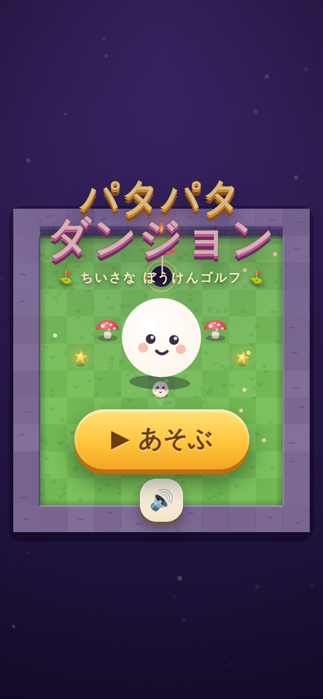
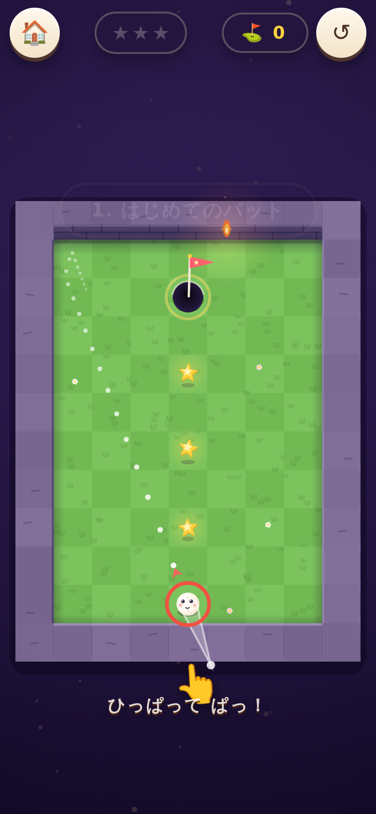
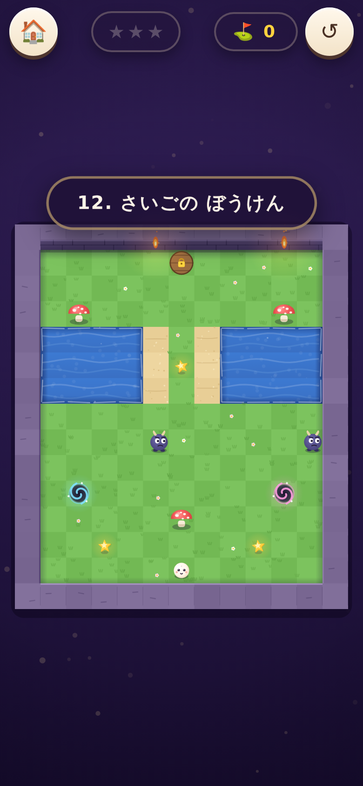

# ⛳ パタパタダンジョン

**Par for the Dungeon** にインスパイアされた、4歳から遊べる「ひっぱってうつ」ダンジョンゴルフです。
iPhone / iPad の **縦画面・横画面どちらでも** 遊べます。外部ライブラリ・外部アセットなしの純粋な HTML5 / Canvas 製。

<p align="center">
  
  
  
</p>

## あそびかた

1. 画面のどこでもいいので **ゆびでひっぱる**(スリングショット式。ボールを直接さわらなくてOK)
2. 白い点々が「とぶみち」。はなすと ぱっ!と飛ぶ
3. **カップ(はた)にいれたらクリア!** ⭐を3つあつめよう
4. なんども打ってOK。水に落ちてもペナルティなし。失敗のないゲームです

## しかけ

| しかけ | せつめい |
|---|---|
| 🍄 キノコバンパー | あたると ボヨーン!と はねとばされる |
| 🏖️ すなば | ボールが ゆっくりになる |
| 🌊 みず | おっこちると スプラッシュ!(そっと もとの場所へ) |
| 💨 ブーストパッド | びゅーん!と かそくする |
| 🌀 ポータル | ふしぎなとびら。べつの場所へ ワープ |
| 👿 ボギー | いたずらもの。はやいボールを ぶつけて ボンク! |
| 🔒 カギつきホール | ボギーを ぜんいん ボンクすると あく |

全12レベル。クリアすると次のレベルがあきます(進捗は端末に自動保存)。

## 遊び方(起動)

静的ファイルだけなので、そのままホスティングできます。

```bash
# ローカルで
cd patapata-dungeon
python3 -m http.server 8000
# → http://localhost:8000 をブラウザで開く
```

GitHub Pages に置く場合はこのフォルダを公開ディレクトリにするだけです。
iPhone / iPad では Safari で開いて **「ホーム画面に追加」** すると、全画面のアプリとして遊べます。

## 4歳児むけの設計

- **文字が読めなくても遊べる**: 操作はドラッグひとつ。ボタンはすべて大きなアイコン
- **失敗がない**: 打数制限なし、敵にあたっても痛くない、水に落ちてもやさしく復活
- **ごほうび重視**: 星・紙吹雪・ファンファーレ・キラキラで「できた!」をたくさん演出
- **おおらかな判定**: カップには吸い込み(マグネット)、星は大きめの取得半径
- **誤操作防止**: ピンチズーム・ダブルタップズーム・スクロールをすべて抑制

## こだわりの描写

- 芝生・石壁・砂・水面はセルごとに手続き生成でベイク(草のふさ、花、レンガの目地、熊手あと…)
- ゆらめく松明の炎と加算合成の灯り、ただよう光の粒、ビネット
- ボールはまばたき・表情変化(びっくり/にっこり/やるき)・つぶれ(スカッシュ&ストレッチ)つき
- 波のハイライト・岸の泡・水しぶき・波紋、ボンクの煙、紙吹雪などのパーティクル
- 効果音とオルゴール風BGMはすべて WebAudio でリアルタイム合成(音声ファイルなし)

## ファイル構成

```
patapata-dungeon/
├── index.html              エントリポイント
├── manifest.webmanifest    PWAマニフェスト(ホーム画面追加用)
├── css/style.css           UIスタイル(タイトル/HUD/クリア画面)
├── js/
│   ├── audio.js            WebAudio 効果音 + オルゴールBGM
│   ├── levels.js           全12レベルのASCIIマップ定義
│   ├── particles.js        パーティクルシステム
│   ├── game.js             物理・衝突・レベル進行(コアロジック)
│   ├── render.js           Canvasレンダラー(ベイク+毎フレーム描画)
│   ├── input.js            スリングショット入力(Pointer Events)
│   ├── ui.js               画面遷移・HUD・進捗保存(localStorage)
│   └── main.js             起動・メインループ
├── assets/                 アイコン(SVG / apple-touch-icon)
└── screenshots/            スクリーンショット
```

## レベルを増やすには

`js/levels.js` にASCIIマップを足すだけです。

```
#  かべ          .  しばふ         ,  すな
~  みず          o  キノコバンパー  ^v<> ブーストパッド
S  スタート      H  ホール          G  カギつきホール
b  ボギー(よこ)  d  ボギー(たて)    *  ほし(3つ置く)
1 2  ポータルのペア
```
